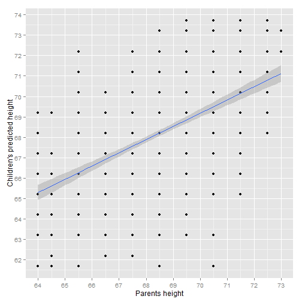

Course Project: Shiny Application and Reproducible Pitch
========================================================
author: Patricio Moreno A.
date: Noviembre 22, 2015


Course Project
========================================================

* This is the final presentation for the Course Project of the "Developing data products" course
* This course is part of the "Data Science specialization"
* The project consists in two activities:
 + Create a **Shiny** application
 + Create a presentation in Slidify or **Rstudio Presenter** to pitch for the application.


My Shiny Application: Dataset
========================================================
* For this assignment, we used the `galton` dataset from `UsingR` package.
* This is a tabulated data set collected and used by Sir Francis Galton in 1885, to study the relationship between a parent's height and their childrens.
* Some information about the dataset:


```r
summary(galton)
```

```
     child           parent     
 Min.   :61.70   Min.   :64.00  
 1st Qu.:66.20   1st Qu.:67.50  
 Median :68.20   Median :68.50  
 Mean   :68.09   Mean   :68.31  
 3rd Qu.:70.20   3rd Qu.:69.50  
 Max.   :73.70   Max.   :73.00  
```

My Shiny Application: Model
========================================================
* We used `lm` to fit a linear model based on `galton` dataset.

* With this linear model, we can predict a child's height based on the parent's average height.


```r
r <- lm(child~parent, galton)
```

* The fitted model formula for prediction is:

$$Child=Parent*0,64629+23,94153$$


My Shiny Application: Regression line
========================================================
* This is a graphic representation of the dataset, the dots represents the observations.
* The regression line is shown in blue (with its 95% confidence interval).

***
 

My Shiny Application
========================================================
* The application can be found in https://pjmorenoa.shinyapps.io/Galton
*
